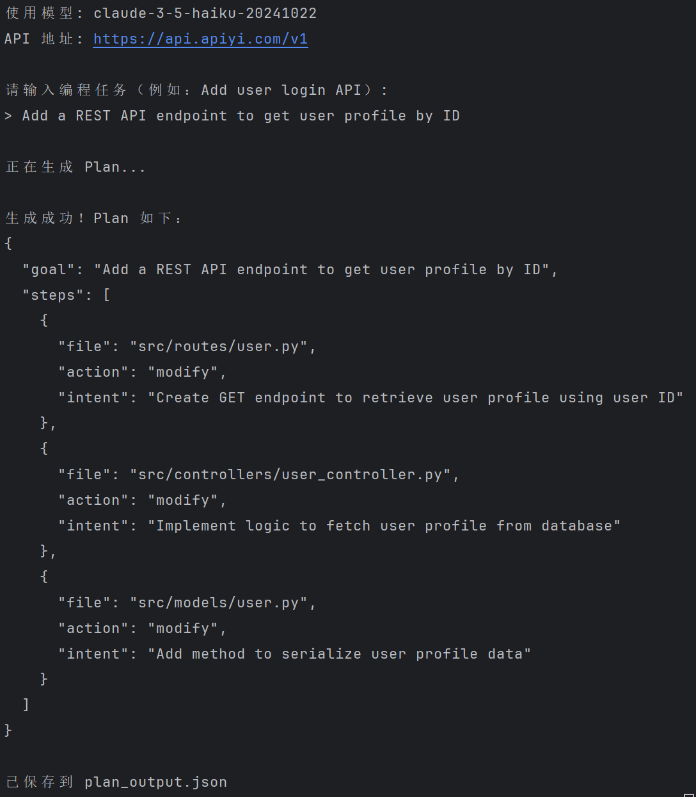

# Cursor / Claude的 “Plan模式模式简化复现

> 基于Cursor / Claude的 “Plan模式” 原理，用 Python 实现一个轻量级任务分解引擎.
>实现输入自然语言需求，输出结构化文件修改计划。

## 项目目标

本项目包含两部分：
- **技术报告**（`docs/technical_report.md`）
- 分析原理、设计与产品思考


- **可运行代码**（`src/`, `example_usage.py`）
- 复现AI编程工具中的 **Plan模式核心逻辑**：先输出计划，再生成代码
- 验证 **“设计先行”** 的人机协作范式可行性
- 提供一个可扩展、模型无关的Plan生成框架

## 核心特性

- 输入：任意自然语言编程任务（如 _“Add user profile API”_）
- 输出：标准 JSON 格式的结构化计划，包含：
  - `goal`：原始需求
  - `steps`：文件路径、操作类型（create/modify）、修改意图
- 支持主流大模型
- 安全管理API密钥（使用 `.env`）

## 快速开始

### 1. 安装依赖
```env
pip install -r requirements.txt
```

### 2. 配置 API 密钥

**创建 `.env` 文件**  
   在项目根目录下新建 `.env` 文件（与 `demo.py` 同级）：
```env
API_KEY=sk-xxxx
BASE_URL=https://api.apiyi.com/v1
MODEL_NAME=claude-3-5-haiku-20241022
 ```

### 3. 运行demo
```env
python demo.py
 ```
输入示例
```env
Add a REST API endpoint to get user profile by ID
 ```
输出示例
```env
{
  "goal": "Add a REST API endpoint to get user profile by ID",
  "steps": [
    {
      "file": "src/routes/user.py",
      "action": "modify",
      "intent": "Create GET endpoint to retrieve user profile using user ID"
    },
    {
      "file": "src/controllers/user_controller.py",
      "action": "modify",
      "intent": "Implement logic to fetch user profile from database"
    },
    {
      "file": "src/models/user.py",
      "action": "modify",
      "intent": "Add method to serialize user profile data"
    }
  ]
}
 ```
